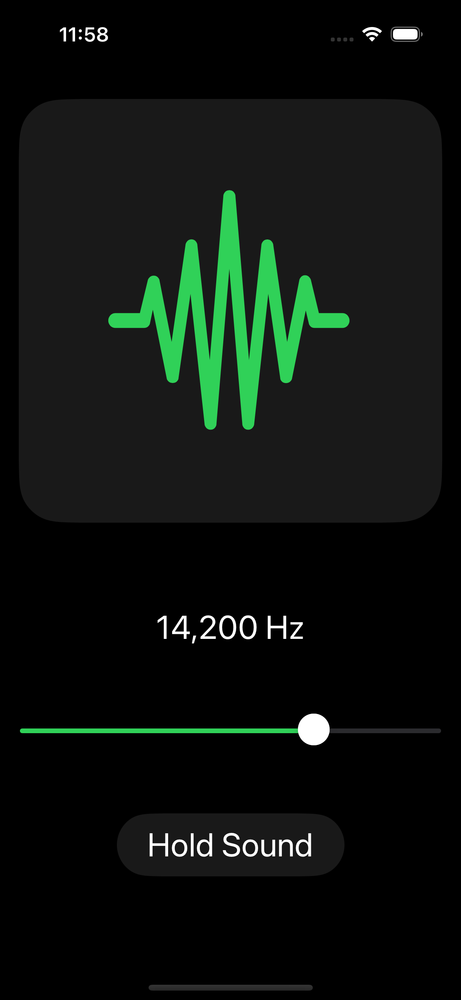
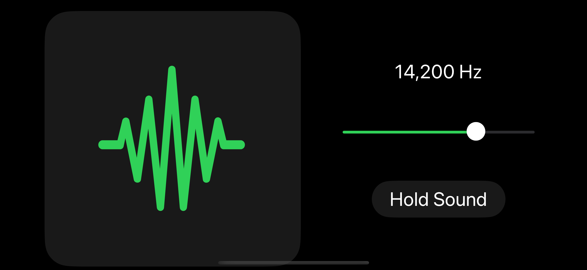

# Shush Puppy

## Description
Shush Puppy is an iOS application developed using SwiftUI, designed to assist pet owners in training their dogs to reduce barking. The app utilizes sound frequencies to gently and effectively guide dogs towards quieter behavior. Featuring a user-friendly interface and leveraging advanced audio processing techniques, Shush Puppy is a perfect companion for pet owners seeking a humane and effective training tool.

## Features
- **Sound Frequency Training**: Utilizes a range of sound frequencies to capture a dog’s attention and reduce barking.
- **User-Friendly Interface**: Easy-to-navigate design, built entirely in SwiftUI for a seamless user experience across various iOS devices.
- **Customizable Settings**: Adjustable frequency settings to cater to individual dog’s hearing.
- **AVFoundation for Audio Processing**: Implements Apple's AVFoundation to handle audio functionalities efficiently.




## Installation
To install Shush Puppy, clone this repository and open the project in Xcode. 
```
git clone https://github.com/fbabonoy/Shush-Signal.git
cd shushpuppy
```
Then, run the project using the Xcode simulator or on a physical iOS device.

## Usage
Upon launching Shush Puppy, users can select different sound frequencies to play. The main screen provides easy access to frequency settings and play controls. Users can test different frequencies to find the most effective one for their dog.


## Contributing
Contributions to the Shush Puppy project are welcome. If you wish to contribute, please fork the repository and submit a pull request with your proposed changes. For major changes, please open an issue first to discuss what you would like to change.

## License
[MIT](https://choosealicense.com/licenses/mit/)
